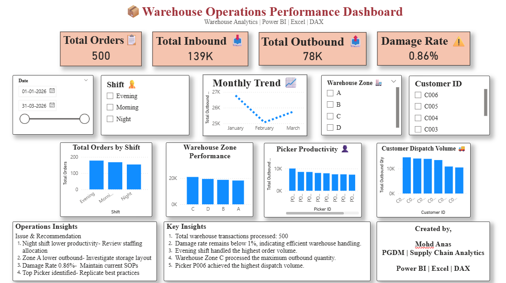

# 📦 Warehouse Operations Performance Dashboard



---

## 📖 Project Overview

This project presents an interactive **Warehouse Operations Performance Dashboard** built using **Power BI, Excel, and DAX**.

The dashboard monitors key warehouse performance indicators and provides actionable insights to support data-driven operational decisions.

The project simulates warehouse operations using a dataset of **500 warehouse transactions**, covering inbound, outbound, inventory handling, picker productivity, warehouse zone performance, and customer dispatch analysis.

---

## 🎯 Business Problem

Warehouse managers require real-time visibility into warehouse operations to monitor productivity, reduce damages, improve dispatch efficiency, and optimize workforce allocation.

This dashboard was developed to provide a centralized view of operational KPIs for faster and more informed decision-making.

---

## 🎯 Objectives

- Monitor warehouse performance
- Analyze inbound and outbound quantities
- Track damage rate
- Evaluate picker productivity
- Compare warehouse zone performance
- Analyze customer dispatch volume
- Support operational decision-making

---

# 📊 Dashboard Features

✅ KPI Cards

- Total Orders
- Total Inbound Quantity
- Total Outbound Quantity
- Damage Rate

---

✅ Interactive Filters

- Date
- Shift
- Warehouse Zone
- Customer ID

---

✅ Visualizations

- Monthly Outbound Trend
- Orders by Shift
- Warehouse Zone Performance
- Picker Productivity
- Customer Dispatch Volume

---

## 📈 Key Business Insights

- Evening Shift processed the highest number of orders.
- Damage Rate remained below 1%, indicating efficient warehouse handling.
- Warehouse Zone C recorded the highest outbound quantity.
- Picker P006 achieved the highest productivity.
- Customer dispatch analysis identified high-volume customers.

---

## 💡 Operational Recommendations

- Review staffing allocation during Night Shift.
- Investigate Zone A warehouse layout to improve outbound efficiency.
- Continue following existing warehouse handling SOPs.
- Replicate best practices from top-performing pickers.

---

## 🛠 Tools Used

| Tool | Purpose |
|------|----------|
| Excel | Data Preparation |
| Power BI | Dashboard Development |
| DAX | KPI Calculations |
| GitHub | Portfolio Hosting |

---

## 📂 Dataset

The project uses a simulated warehouse dataset containing approximately **500 warehouse transactions**.

Dataset includes:

- Order Date
- Shift
- Customer ID
- SKU
- Inbound Quantity
- Outbound Quantity
- Receiving Time
- Picking Time
- Packing Time
- Dispatch Time
- Damage Quantity
- Picker ID
- Warehouse Zone

---

## 🚀 Skills Demonstrated

- Supply Chain Analytics
- Warehouse Operations Analysis
- Power BI Dashboard Development
- Excel Data Analysis
- DAX Measures
- KPI Design
- Business Intelligence
- Data Visualization

---

## 📷 Dashboard Screenshot


---

## 📁 Project Structure

```

Warehouse-KPI-Dashboard/

│── Dashboard.pbix
│── Warehouse_Dataset.xlsx
│── Dashboard.png
│── README.md
```

---

## 👨‍💼 About Me

**Mohd Anas**

PGDM (General Management)

Interested in:

- Supply Chain Management
- Logistics
- Warehouse Operations
- Business Analytics
- Power BI

GitHub:
[https://github.com/anasmuhammad3778-BTS]

LinkedIn:
[linkedin.com/in/mohd-anas-64a07a1b2]

---

## ⭐ Future Improvements

- Live SQL Database Integration
- Real-time Dashboard Refresh
- Inventory Aging Dashboard
- Transportation Analytics
- AI-based Demand Forecasting

---

## ⭐ If you found this project useful, feel free to Star the repository.

Thank you for visiting!
